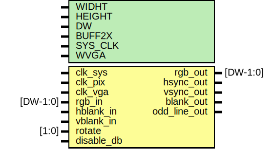

# Entity: framebuffer

- **File**: framebuffer.sv

## Diagram

## Generics

| Generic name | Type | Value | Description                   |
| ------------ | ---- | ----- | ----------------------------- |
| WIDHT        |      | 320   | Resolution Width              |
| HEIGHT       |      | 240   | Resolution Height             |
| DW           |      | 8     | Video Data Width              |
| BUFF2X       |      | 0     | Use Double Buffering          |
| SYS_CLK      |      | 0     | Use System Clock              |
| WVGA         |      | 0     | Use Wide VGA 720x480 (3:2 AR) |

## Ports

| Port name    | Direction | Type     | Description                                                            |
| ------------ | --------- | -------- | ---------------------------------------------------------------------- |
| clk_sys      | input     |          | System Clock                                                           |
| clk_pix      | input     |          | Core Pixel Clock                                                       |
| clk_vga      | input     |          | VGA Output Clock                                                       |
| rgb_in       | input     | [DW-1:0] | RGB Video Input                                                        |
| hblank_in    | input     |          | Horizontal Blank                                                       |
| vblank_in    | input     |          | Vertical Blank                                                         |
| rgb_out      | output    | [DW-1:0] | RBG Video Output                                                       |
| hsync_out    | output    |          | Horizontal Sync                                                        |
| vsync_out    | output    |          | Vertical Sync                                                          |
| blank_out    | output    |          | Video Blank                                                            |
| rotate       | input     | [1:0]    | Screen Rotation: [0] No Rotation - [1] 90 CW - [2] 180 CW - [3] 90 CCW |
| disable_db   | input     |          | Disable Double Buffering                                               |
| odd_line_out | output    |          | Odd Line Detector                                                      |

## Signals

| Name            | Type          | Description                                                                                                                                     |
| --------------- | ------------- | ----------------------------------------------------------------------------------------------------------------------------------------------- |
| pixel_wr_addr   | reg  [AW-1:0] | The input video process is responsible for writing the pixel data into the correct buffer address                                               |
| pixel_rd_addr   | reg  [AW-1:0] | The output video process is responsible for reading the correct pixel data to display on the screen                                             |
| pixel_data1     | wire [DW-1:0] | The pixel data that is currently being output from buffer 1                                                                                     |
| pixel_data2     | wire [DW-1:0] | The pixel data that is currently being output from buffer 2                                                                                     |
| pixel_de        | reg           | The output video process is currently displaying the image on the screen                                                                        |
| pixel_clock     | wire          | Internal Pixel Clock will use clk_pix or clk_sys if [SYS_CLK] is enable                                                                         |
| active_buffer   | reg           | Using either buffer 1 or buffer 2 to output video                                                                                               |
| buffer1_wren    | reg           | Buffer 1 is ready to receive new pixel data                                                                                                     |
| buffer1_writing | reg           | Writing new pixel data into buffer 1                                                                                                            |
| buffer1_clr     | reg           | The buffer has been fully used, so that it can be cleared and used again                                                                        |
| buffer1_ready   | reg           | First buffer is completely filled with pixel data                                                                                               |
| buffer2_wren    | reg           | Buffer 2 is ready to receive new pixel data                                                                                                     |
| buffer2_writing | reg           | The system is currently writing new pixel data into buffer 2                                                                                    |
| buffer2_clr     | reg           | The buffer has been fully used, so that it can be cleared and used again                                                                        |
| buffer2_ready   | reg           | Second buffer is completely filled with pixel data.                                                                                             |
| window_hcnt     | reg     [9:0] | Horizontal position of the pixel currently being displayed on the screen, with a maximum width of 1024 pixels                                   |
| window_vcnt     | reg     [9:0] | Vertical position of the line currently being displayed on the screen, with a maximum height of 1024 lines                                      |
| hcnt            | reg    [10:0] | Total number of pixels that are being output, including those that are not currently visible on the screen, with a maximum count of 2048 pixels |
| vcnt            | reg    [10:0] | Total number of lines that are being output, including those that are not currently visible on the screen, with a maximum count of 2048 lines   |
| i_hcnt          | reg     [9:0] | Input Pixel Count, up to 1024 Pixels                                                                                                            |
| i_vcnt          | reg     [8:0] | Input Line Count, up to 512 Lines                                                                                                               |
| h_active        | integer       | Horizontal/Vertical Active Pixels                                                                                                               |
| v_active        | integer       | Horizontal/Vertical Active Pixels                                                                                                               |
| h_sync_start    | integer       | Horizontal/Vertical Sync Start                                                                                                                  |
| v_sync_start    | integer       | Horizontal/Vertical Sync Start                                                                                                                  |
| h_sync_end      | integer       | Horizontal/Vertical Sync End                                                                                                                    |
| v_sync_end      | integer       | Horizontal/Vertical Sync End                                                                                                                    |
| h_total         | integer       | Horizontal/Vertical Total Pixels                                                                                                                |
| v_total         | integer       | Horizontal/Vertical Total Pixels                                                                                                                |
| h_scale         | integer       | Horizontal Scale Factor and Counter                                                                                                             |
| h_scale_cnt     | integer       | Horizontal Scale Factor and Counter                                                                                                             |
| v_scale         | integer       | Vertical Scale Factor and Counter                                                                                                               |
| v_scale_cnt     | integer       | Vertical Scale Factor and Counter                                                                                                               |
| h_pos_start     | integer       | Initial X/Y Position on Output Screen                                                                                                           |
| v_pos_start     | integer       | Initial X/Y Position on Output Screen                                                                                                           |
| h_pos_end       | integer       | Final   X/Y Position on Output Screen                                                                                                           |
| v_pos_end       | integer       | Final   X/Y Position on Output Screen                                                                                                           |

## Constants

| Name   | Type | Value                  | Description                                                                     |
| ------ | ---- | ---------------------- | ------------------------------------------------------------------------------- |
| hc_max |      | WIDHT                  | Number of Horizontal Visible Pixels (Before Scandoubler)                        |
| vc_max |      | HEIGHT                 | Number of Vertical   Visible Pixels (Before Scandoubler)                        |
| AW     |      | $clog2(WIDHT * HEIGHT) | Minimum width required to address the number of pixels for a given framebuffer. |

## Processes

- BufferWriteControl: ( @(posedge pixel_clock) )
  - **Type:** always
- ModelineSelection: ( @(posedge clk_vga) )
  - **Type:** always
- PixelCounter: ( @(posedge clk_vga) )
  - **Type:** always
- CalculateReadAddress: ( @(posedge clk_vga) )
  - **Type:** always
- SetOutputs: ( @(posedge clk_vga) )
  - **Type:** always

## Instantiations

- framebuffer1: framebuffer_vram
