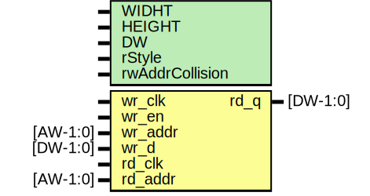

# Entity: framebuffer_vram

- **File**: framebuffer_vram.sv

## Diagram

## Generics

| Generic name    | Type | Value         | Description     |
| --------------- | ---- | ------------- | --------------- |
| WIDHT           |      | 320           | Data Port Width |
| HEIGHT          |      | 240           | Data Port Width |
| DW              |      | 8             | Data Port Width |
| rStyle          |      | "no_rw_check" |                 |
| rwAddrCollision |      | "auto"        |                 |

## Ports

| Port name | Direction | Type     | Description    |
| --------- | --------- | -------- | -------------- |
| wr_clk    | input     |          | Write Clock    |
| wr_en     | input     |          | Write Enable   |
| wr_addr   | input     | [AW-1:0] | Write Address  |
| wr_d      | input     | [DW-1:0] | Write Data Bus |
| rd_clk    | input     |          | Read Clock     |
| rd_addr   | input     | [AW-1:0] | Read Address   |
| rd_q      | output    | [DW-1:0] | Read Data Bus  |

## Signals

| Name | Type           | Description           |
| ---- | -------------- | --------------------- |
| ram  | logic [DW-1:0] | Register to Hold Data |

## Constants

| Name | Type | Value                  | Description        |
| ---- | ---- | ---------------------- | ------------------ |
| AW   |      | $clog2(WIDHT * HEIGHT) | Address Port Width |

## Processes

- WriteToMem: ( @(posedge wr_clk) )
  - **Type:** always
- ReadFromMem: ( @(posedge rd_clk) )
  - **Type:** always
